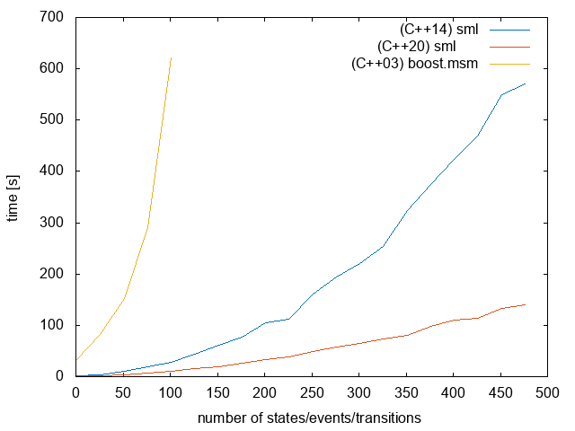
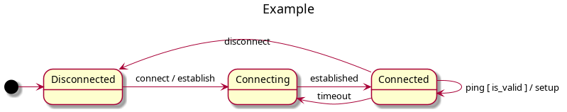

<a href="http://www.boost.org/LICENSE_1_0.txt" target="_blank"></a>
<a href="https://github.com/boost-ext/sml2/releases" target="_blank"></a>
<a href="https://godbolt.org/z/eorGK5sEW"></a>
<a href="https://godbolt.org/z/j51Tch6PT"></a>

---------------------------------------

### SML2 (UML-2.5 State Machine Language)

* C++20 ([Clang-15+, GCC-12+](https://godbolt.org/z/eorGK5sEW))
* Single header - https://raw.githubusercontent.com/boost-ext/sml2/main/sml2
* No dependencies (Neither Boost nor STL is required)
    * No `virtual` used (-fno-rtti)
    * No `exceptions` required (-fno-exceptions)
* [Library tests itself at compile-time upon include/import](https://github.com/boost-ext/sml2/blob/main/sml2#L388)
    * Basically guaranteed no UB, no leaks
* Optimized run-time execution
    * https://godbolt.org/z/W9rP94cYK
* Fast compilation times
    <p align="center"></p>
* Declarative Domain Specific Language (DSL)
<p align="center"></p>

```cpp
// events
struct connect {};
struct ping { bool valid = false; };
struct established {};
struct timeout {};
struct disconnect {};

int main() {
  // state machine
  sml::sm connection = [] {
    // guards
    auto is_valid  = [](const auto& event) { return event.valid; };

    // actions
    auto establish = [] { std::puts("establish"); };
    auto close     = [] { std::puts("close"); };
    auto setup     = [] { std::puts("setup"); };

    using namespace sml::dsl;
    /**
     * src_state + event [ guard ] / action = dst_state
     */
    return transition_table{
      *"Disconnected"_s + event<connect> / establish    = "Connecting"_s,
       "Connecting"_s   + event<established>            = "Connected"_s,
       "Connected"_s    + event<ping>[is_valid] / setup,
       "Connected"_s    + event<timeout> / establish    = "Connecting"_s,
       "Connected"_s    + event<disconnect> / close     = "Disconnected"_s,
    };
  };

  connection.process_event(connect{});
  connection.process_event(established{});
  connection.process_event(ping{.valid = true});
  connection.process_event(disconnect{});
}
```

---

### FAQ

- Why would I use a state machine?

    > State machine helps with understanding of the application flow as well as with avoiding spaghetti code.
      The more booleans/enums/conditions there are the harder is to understand the implicit state of the program.
      State machines make the state explicit which makes the code easier to follow,change and maintain.
      It's worth noticing that state machines are not required by any means (there is no silver bullet),
      switch-case, if-else, co-routines, state pattern, etc. can be used instead. Use your own judgment and
      experience when choosing a solution based its trade-offs.

- I don't understand it, why wouldn't I simply use switch-case or state pattern?

    > Switch-case, state pattern can be used instead of state machines, however, the maintance of such solutions in the long term is arguable due to the growing complexity over time.

- What features are supported and what features will be supported?

    > ATM SML2 supports basic UML features such as transitions, processing events, unexpected events, etc.
      Please follow tests/examples to stay up to date with available features - https://github.com/boost-ext/sml2/blob/main/sml2#L388
      There is plan to add more features, potentially up to full UML-2.5 support.

- What does mean that it tests itself?

    > Testing itself upon use means that whenever the sml2 is included/imported all tests are being executed at compile-time.

- Why testing upon use?

    > Traditional way of testing libraries includes continuous integration systems with huge matrix of possible combinations of supported compilers/systems etc.
      Although, that's very powerful there is no way to verify all possible combinations and users often assume that the library just works as it's already tested
      without verifying on their environment. With ability to test the library upon use additional guarantees can be put in place (accordingly to the quality of tests).
      For example, it can be basically guaranteed that the tested features are working as expected without any leaks and/or UB if the library compiles upon include/import.
      The feedback is immediate and constantly verified making the solution reliable and without run-time surprises on the client side.

- Is testing itself causing a run-time overhead?

    > No. All tests are executed at compile time via static_asserts.

- How much compilation time does it cost during include/import?

    > Running all tests during include/import costs around 30ms out of 120ms for the example state machine.
      The cost is associated to translation unit, not an import/include (due to header guards).
      To limit the cost precompiled headers can be used.

- What does it mean that no UB, no leaks are guaranteed?

    > No UB and no leaks guarantee means that all SML2 tests are executed at compile upon include/import and there is no
      external dependencies. Because of that tests won't compile if there is an UB and/or leak due to constexpr execution
      guarantees in C++ (also depends on the compiler quality).

- Can I disable running tests upon use?

    > Yes. Define `SML2_DISABLE_STATIC_ASSERT_TESTS`.  Running compile-time tests upon import/include is essential for correctness, though, so use with cautious.

- What features enables the fast compile time times and running tests upon use?

    > Mainly C++20 relaxed constexpr execution and template meta-programming tricks for better compilation-time performance.

- How can I check whether my compiler/system is supported?

    > The easiest way would be to include/import sml2. If it compiles it works!
      You can also test different compilers on godbolt here - https://godbolt.org/z/W9rP94cYK

- Can I use SML2 at compile-time?

    > Yes. SML2 is fully compile-time but it can be executed at run-time as well. The run-time is primary use case for SML2.

- How does it compare to implementing state machines with co-routines?

   > It's a different approach. Either has its pros and cons. Co-routines are easier to be executed in parallel but they have performance overhead.
     Co-routines based state machines are written in imperative style whilst SML is using declarative Domain Specific Language (DSL).
     More information can be found here - https://youtu.be/Zb6xcd2as6o?t=1529

- Is there any tutorial?

    > Please take a look at - https://boost-ext.github.io/sml/tutorial.html

- Why there is no file extension for SML2?

    > SML2 is both: a header and a module so it follows STL and it doesn't have an extensions (for different reasons).

- Do I need modules support to use SML2?

    > No. SML2 can be either included or imported.

- Is SML2 SFINAE friendly?

    > Yes, SML2 is SFINAE (Substitution Failure Is Not An Error) friendly, especially the call to `process_event`.

- What is the difference between original SML and SML2?

    > There are few design differences.
        - SML is more feature reach and more complete
        - SML2 is compile-time first
        - dependencies are not injected directly to guards/actions. Instead capture lambdas are used.

- Will original SML still be supported?

    > Yes. SML2 is a different project.

- Should I switch to SML2 from SML?

    > It depends. SML2 is not as feature reach and production ready as SML and it requires C++20, however it compiles much faster.

- Where can I find/execute benchmarks?

    > Benchmarks can be found here - https://github.com/boost-ext/sml/tree/master/benchmark

- SML vs UML?

    > SML2 follows UML-2.5 - http://www.omg.org/spec/UML/2.5 - as closeily as possible but it has limited features ATM.
      More information can be found here - https://boost-ext.github.io/sml/uml_vs_sml.html

- I don't understand the implementation. How is that working?

    > The implementatino is using C++20 features as well as template meta programming features to achive its performance and compiliation-time speed.
      The main has been been exaplained here - https://www.youtube.com/watch?v=j0J33BnIjnU&ab_channel=CppNow

- Why statefull TMP has been used?

    > Stateful TMP has been used purely for compilation performance. Is not required strictly speaking but it helps with simplicity and speeds up compilation times.
      Stateful TMP has been also adopted by C++26 static reflection proposal (https://wg21.link/P2996) - https://www.open-std.org/jtc1/sc22/wg21/docs/papers/2023/p2996r1.html#compile-time-ticket-counter.

- Including/Importing SML2 doesn't compile?

    > Most likely it means that the compiler/env combination is not supported properly.
      SML2 is tested at compile-time upon include/import to guarantee its correctness.
      Please open bug report to track the issue.

- Where can I find more documentation/examples?

    > https://github.com/boost-ext/sml

- How to pass dependencies to guards/actions?

    ```cpp
    struct foo {
      bool value{};

      constexpr auto operator()() const {
        auto guard = [this] { return value; }; // dependency capctured by this
        return transition_table{
            *"s1"_s + event<e1>[guard] = "s2"_s,
        };
      }
    };

    sml::sm sm{foo{.value = 42}); // inject value into foo
    ```

- Is SML2 suitable for embedded systems?

    > Yes, same as SML, SML2 doesn't have any extenal dependencies, compiles without RTTI and without exceptions.
      It's also focused on performance, binary size and memory footprint.
      The following command compiiles without issues:
      `$CXX -std=c++20 -Ofast -fno-rtti -fno-exceptions -Wall -Wextra -Werror -pedantic -pedantic-errors example.cpp`

- Is there a Rust version?

    > Sort of, experimental, with limited features Rust version of SML can be found here - https://gist.github.com/krzysztof-jusiak/079f80e9d8c472b2c8d515cbf07ad665

---

**Disclaimer** `sml2` is not an official Boost library.
